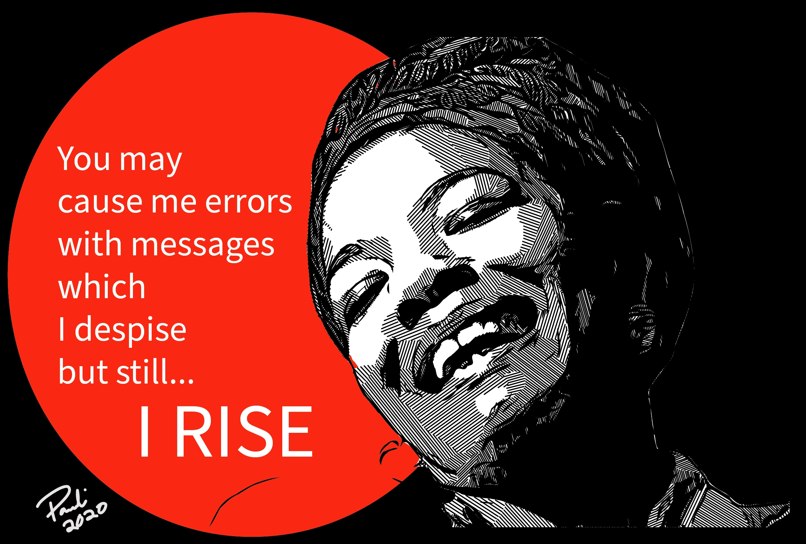

# README

## Developer Depot

[GitBook](https://dcartist.gitbook.io/life-with-code/) View 

### Project Ideas

[Project ideas](project-ideas.md)

### Resources

[Resources](resources.md)

### Steps to think when debugging

1. Acknowledging, understanding your mistakes, and that no one is perfect.
2. **Read your error messages**, and say out loud what the error is telling you.
3. Console log to view what is going on with your code.
4. Think of the **simplest** ways of handling challenges.
5. **SPELLING SPELLING SPELLING** is essential; some of the biggest mistakes are caused by spelling errors.
6. Plan it out! Draw it out! Break everything down into the smallest pieces possible to make things easier on yourself when building.
7. **Breathe!**
8. Rubber Duckie. The rubber duckie is having either a person or an object that you can explain your code to see where your error might be. [https://en.wikipedia.org/wiki/Rubber\_duck\_debugging](https://en.wikipedia.org/wiki/Rubber_duck_debugging)
9. Point and say: The _shisa kanko_ \(指差喚呼\) method is where you point and say what you are about to accomplish. Reading your code aloud \(in detail, line by line\) helps show yourself where you might have gone off the rails. [https://en.wikipedia.org/wiki/Pointing\_and\_calling](https://en.wikipedia.org/wiki/Pointing_and_calling)
10. Take notes. Creating a snippet library of code you know that works will help when it comes to building. Also, going back through your notes and finding more ways to update the code will help with your development.
11. What you think vs. What it is. Going through code, there are moments where you think something happens a certain way but happens in a different way altogether. For example:

    * **Name of variables**: You could have a variable declared in one spot thinking you have used it for a certain but, but end up inserting a  different variable instead of the one you needed, which causes chaos down the line.

    **Example:**

```javascript
//Make a function that prints out the argument to the console log
let apple = "Something completely else"

function thePrinter(insertData){
console.log(apple) // this is the wrong variable 
}

thePrinter("The should print out")
```

* **Objects, arrays, string, or integer?** A gotcha moment is figuring out what you are using. Asking yourself, is it an object, array, string, or integer? We ask this because one huge bug-causing moment is treating what we are working with incorrectly, leading to error messages. 

### Ask yourself some of these questions:

* What do I need to do?
* What data do I need to pull?
* What and where am I storing my data?
* How much do I need to pull?
* Am I actually pulling the right thing?
* What am I looking at?
* What am I doing?
* What am I supposed to do?

## Mindset tools:

When dealing with debugging, there are some mindset tools to help visualize your problems.

1. Remember, your errors are not permanent failures or make you a terrible programmer but are learning processes. 
2. In a couple of months, no one knows everything about coding; don't expect yourself to know everything. 
3. Senior Devs are developers who experienced more error messages than you. So be prepared for a life filled with error messages. Your code will never always be perfect but can be worked towards something incredible.
4. There will be tears. There will be moments where you want to cry, so let those tears flow.
5. Take a break. If things are stressful, take a break; when you haven't eaten anything, take a break. 
6. Allow yourself to be a mad scientist. When the questions come of wondering what will happen, don't stop on, just wonder. Test out the theory and document the outcome.
7. Telling yourself that you are terrible keeps you in a repeated mindset that you will be terrible. You will be more likely to sabotage yourself to stay in that mindset.
8. Be proud and embrace the errors. Seeing errors, not as the end of the world but a moment in code, helps bring the stress level down some to be able to focus. Also, you now know how to work through that error when it shows up again.
9. Maya Angelou Quote: If you don't like something, change it. If you can't change it, change your attitude. **Don't complain**.
10. You are not your code; you just built some small wonky code.
11. You are not a machine, and no one expects you to be one.
12. Always study, keep learning and keep going. Never settle. There's a reason why things constantly update!
13. **I don't know** vs. **I haven't grasped it yet**. It's a part of the growth mindset. Your mind is in constant change, especially when learning. Just like plants, we need certain things for growth, and when it comes to learning, what you say can determine how you grow.
    * Growth Mindset Cliffnotes youtube version: [https://www.youtube.com/watch?v=M1CHPnZfFmU](https://www.youtube.com/watch?v=M1CHPnZfFmU)
    * Understanding mindset: [https://www.understood.org/articles/en/growth-mindset](https://www.understood.org/articles/en/growth-mindset)
    * Growth Mindset youtube: [https://www.youtube.com/watch?v=hiiEeMN7vbQ](https://www.youtube.com/watch?v=hiiEeMN7vbQ)
14. Sleeping and allowing your body to rest are important tools in debugging.



## 

