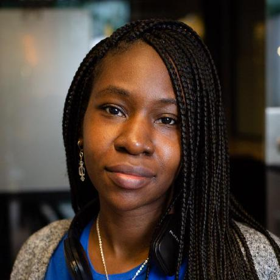

# About

Author of the craziness - Paula Bannerman  
[https://www.linkedin.com/in/dcartist](https://www.linkedin.com/in/dcartist/)  
[https://www.dcartist.studio](https://www.dcartist.studio/)  
Pbannerman13@gmail.com  

### Bio

Born and raised in the Washington DC metro area, I'm an artist and software engineer with 30 years of programming experience. My passion is encouraging others to find their passions and get them to the next level, especially in Art and STEAM/STEM-related fields.   
  
Art is a very powerful and an underestimated tool, especially with the STEM movement. Art is imagination, inspiration, support, creation, and also a communications tool. I believe that programming, science, engineering is all forms of art that are usable instead of just being placed in a museum.

