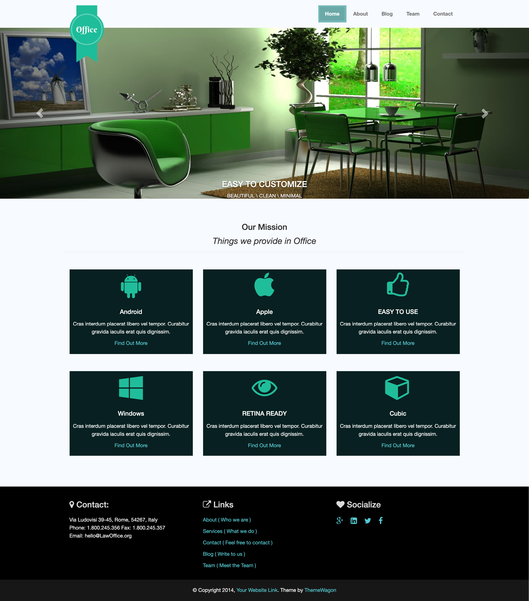

# Planning

Here is an example of planning out your code:

Let's say you want to build out a webpage to look like this. you can break down the code and draw it out.

Diagram of a sample plan \(it doesn't have to be exactly like this\):

