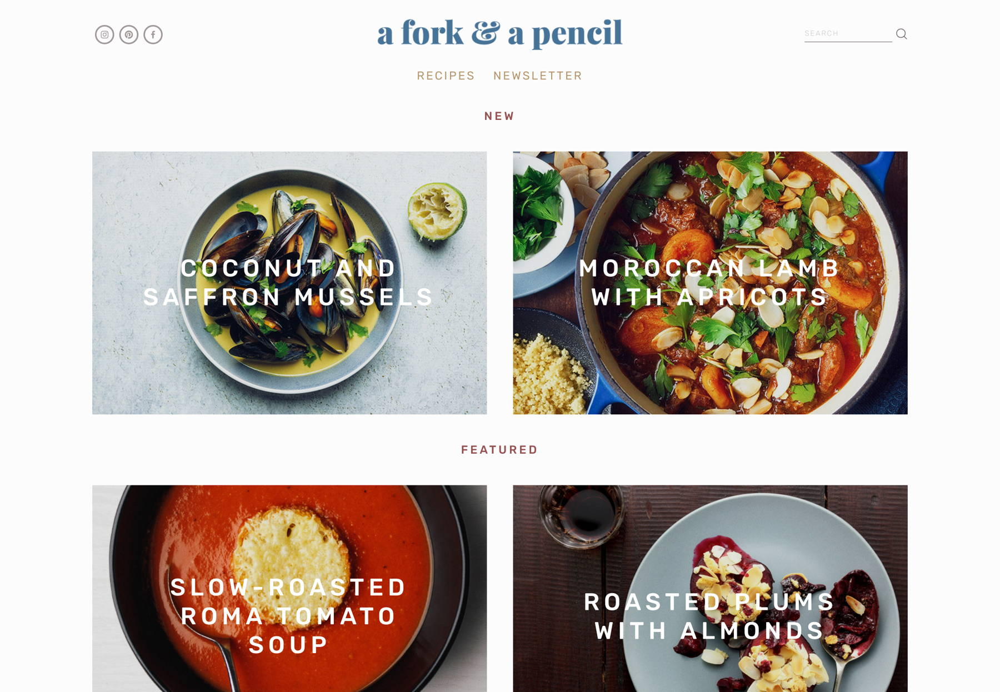
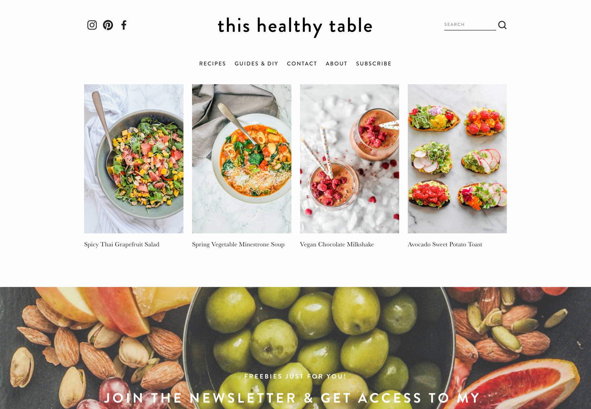

# Project Ideas

Starting apps can be very frustrating when starting because there's the big question of what to build.

## FrontEnd

* Weather API - Weather API  \(inspiration: [https://webdesignledger.com/30-cool-weather-mobile-app-designs-inspiration](https://webdesignledger.com/30-cool-weather-mobile-app-designs-inspiration/) \) 
* Game to show logic
* Drink app using Drink API \([thedrinkblog.com](https://thedrinkblog.com/)\) 
* Meal App  \(inspirational food sites: [https://www.sitebuilderreport.com/inspiration/food-websites](https://www.sitebuilderreport.com/inspiration/food-websites) \) 
* Wiki Type page
* Dashboard

## BackEnd

Swagger or use Express to create a front end to show what the API does.  
[https://swagger.io/tools/swagger-ui/](https://swagger.io/tools/swagger-ui/)

* RESTful Full CRUD API
* RESTful Full CRUD API WITH SECURITY

Inspiration:

* Banking \(Having login, account information, being able to do transactions\)
* User Authentication System
* Government Data. Taking a dataset from a government department and building out an API based upon the data. Data USA: [https://datausa.io/about/api](https://datausa.io/about/api/) Code.gov: [https://code.gov/agencies](https://code.gov/agencies)

## Full-stack

Many of the previously mentioned apps can be used as a full-stack

* Instagram \(Auth possible, Cloudinary for image uploads\)
* todo list connect to Calendarly or google [https://bashooka.com/inspiration/to-do-list-app-ui-designs/](https://bashooka.com/inspiration/to-do-list-app-ui-designs/) [https://medium.muz.li/todo-list-inspiration-a1d736c2718a](https://medium.muz.li/todo-list-inspiration-a1d736c2718a)
* Blog \(Personal, Travel or Special Interest\) [https://www.sitebuilderreport.com/inspiration/blog-examples](https://www.sitebuilderreport.com/inspiration/blog-examples)

