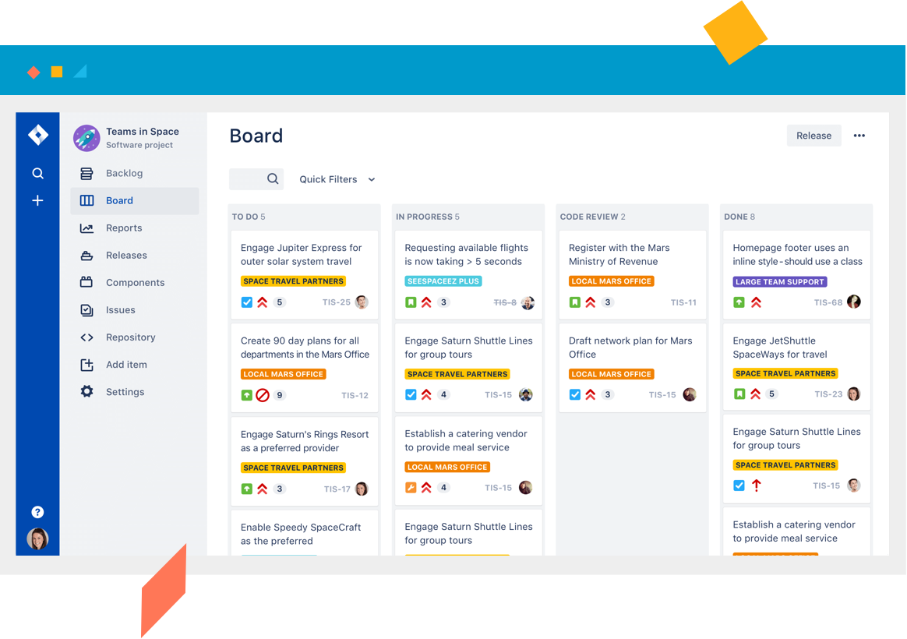

# Resources

## WRITING SOFTWARE:

Grammarly \(chrome extension\) : [https://www.grammarly.com](https://www.grammarly.com/)

## NOTE TAKING:

Evernote \(universal\): [https://evernote.com/](https://evernote.com/)  
Snippets Lab \(mac\): [https://www.renfei.org/snippets-lab](https://www.renfei.org/snippets-lab/)  
Notion \(online\): [https://www.notion.so/product](https://www.notion.so/product)  
Quiver \(mac\): [https://www.notion.so/product](https://www.notion.so/product)  
CherryTree \(Win/Mac/Linux\): [https://www.giuspen.com/cherrytree](https://www.giuspen.com/cherrytree/)

## README EDITOR:

Typora \(Win/Mac/Linux\): [https://typora.io](https://typora.io/)  
StackEdit \(Online\): [https://stackedit.io](https://stackedit.io/)

## VSCODE EXTENSIONS:

Color Brackets:  
[https://marketplace.visualstudio.com/items?itemName=CoenraadS.bracket-pair-colorizer](https://marketplace.visualstudio.com/items?itemName=CoenraadS.bracket-pair-colorizer)

Git Graph:  
[https://marketplace.visualstudio.com/items?itemName=mhutchie.git-graph](https://marketplace.visualstudio.com/items?itemName=mhutchie.git-graph)

Project Manager:  
[https://marketplace.visualstudio.com/items?itemName=alefragnani.project-manager](https://marketplace.visualstudio.com/items?itemName=alefragnani.project-manager)

Draw.io:  
[https://marketplace.visualstudio.com/items?itemName=hediet.vscode-drawio](https://marketplace.visualstudio.com/items?itemName=hediet.vscode-drawio)

## API Resources

JSON Placeholder - [https://jsonplaceholder.typicode.com](https://jsonplaceholder.typicode.com/)  
REQ \| RES - [https://reqres.in](https://reqres.in/)  
Mockup API - [https://www.mockaroo.com](https://www.mockaroo.com/)

### API List

Public Apis: [https://github.com/public-apis/public-apis](https://github.com/public-apis/public-apis)  
API List: [https://apilist.fun](https://apilist.fun/)  
No Auth needed listing: [https://mixedanalytics.com/blog/list-actually-free-open-no-auth-needed-apis](https://mixedanalytics.com/blog/list-actually-free-open-no-auth-needed-apis/)  
Random Data API - [https://random-data-api.com](https://random-data-api.com/)

### Easy:

* Pokemon API - [https://pokeapi.co/](https://pokeapi.co/)
* Meal DB  - [https://www.themealdb.com/](https://www.themealdb.com/)
* Cocktail DB - [https://www.thecocktaildb.com/](https://www.thecocktaildb.com/)
* Countries - [https://restcountries.eu/](https://restcountries.eu/)
* Fake Store API - [https://fakestoreapi.com/](https://fakestoreapi.com/)
* OMDB - [https://www.omdbapi.com/](https://www.omdbapi.com/)   \(requires token\)
* iex cloud - [https://iexcloud.io/console/](https://iexcloud.io/console/)   \(requires token\)
* Open Library - [https://openlibrary.org/developers/api](https://openlibrary.org/developers/api)
* Makeup Heroku - [http://makeup-api.herokuapp.com/](http://makeup-api.herokuapp.com/) \(Warning it is on Heroku it can be asleep\)
* RestAPIExample - [https://dummy.restapiexample.com/](https://dummy.restapiexample.com/) \(Can get too many requests error\)
* Star Wars API - [https://swapi.dev/](https://swapi.dev/) -  Watch out for the **last slash in the url** & watch for **https** vs ~~**http**~~

### Medium:

* Marvel API - [https://developer.marvel.com](https://developer.marvel.com/) 
* Open Weather API - [https://openweathermap.org/api](https://openweathermap.org/api) - Takes from a couple of hours to a day for key.

### Hard:

Spotify [https://developer.spotify.com/documentation/web-api/](https://developer.spotify.com/documentation/web-api/)

## Planning Apps

[**Excalidraw**](https://excalidraw.com/) - \([https://excalidraw.com](https://excalidraw.com/)\) Drawing app to help with diagrams  
[**Diagrams**](https://app.diagrams.net) - \([https://app.diagrams.net](https://app.diagrams.net/)\) entity relationship diagram software

**Diagram.io** - \([https://dbdiagram.io/home](https://dbdiagram.io/home)\)  
**DB Designer** - \([https://www.dbdesigner.net](https://www.dbdesigner.net/)\)  
**Diagrams.net** - \([https://app.diagrams.net](https://app.diagrams.net/)\)  
**LucidChart** - \([https://www.lucidchart.com/pages/examples/database-design-tool](https://www.lucidchart.com/pages/examples/database-design-tool)\)  
**Drawsql** - \([https://drawsql.app](https://drawsql.app/)\)

**Github Projects** \(Check your repo and go to the project tab\) \([https://docs.github.com/en/issues/organizing-your-work-with-project-boards](https://docs.github.com/en/issues/organizing-your-work-with-project-boards)\)

[**Jira**](https://www.atlassian.com/software/jira) - \([https://www.atlassian.com/software/jira](https://www.atlassian.com/software/jira)\) Project management. A wonderful kanban board and project management tools that can be attached to GitHub and bitbucket.

## Charts

Chart JS

* [https://www.chartjs.org](https://www.chartjs.org/)
* [https://www.w3schools.com/ai/ai\_chartjs.asp](https://www.w3schools.com/ai/ai_chartjs.asp)

Google Charts

* [https://developers.google.com/chart](https://developers.google.com/chart)
* [https://www.w3schools.com/ai/ai\_google\_chart.asp](https://www.w3schools.com/ai/ai_google_chart.asp)

D3  - [https://d3js.org](https://d3js.org/)  
Vega - [https://vega.github.io/vega/](https://vega.github.io/vega/)

## Software

RunJs - Able to run your code. A great IDE especially testing a small amount of code.  
[https://runjs.app/](https://runjs.app/)

### Inspirational

[https://www.webdesign-inspiration.com](https://www.webdesign-inspiration.com/)

[https://www.awwwards.com](https://www.awwwards.com/)

